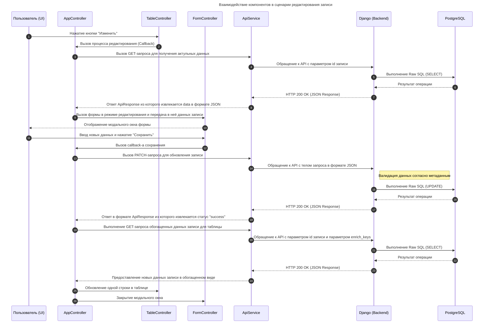

```mermaid
sequenceDiagram
    title Взаимодействие компонентов в сценарии редактирования записи
    autonumber
    participant User as Пользователь (UI)
    participant AppController
    participant TableController
    participant FormController
    participant ApiService
    participant Backend as Django (Backend)
    participant Postgres as PostgreSQL

    User->>TableController: Нажатие кнопки "Изменить"
    TableController->>AppController: Вызов процесса редактирования (Callback)
    AppController->>ApiService: Вызов GET-запроса для получения актульных данных
    
    ApiService->>Backend: Обращение к API с параметром id записи
    Backend->>Postgres: Выполнение Raw SQL (SELECT)
    Postgres-->>Backend: Результат операции
    Backend-->>ApiService: HTTP 200 OK (JSON Response)

    ApiService-->>AppController: Ответ ApiResponse из которого извлекается data в формате JSON
    AppController->>FormController: Вызов формы в режиме редактирования и передача в неё данных записи
    FormController-->>User: Отображение модального окна формы
    User->>FormController: Ввод новых данных и нажатие "Сохранить"
    FormController->>AppController: Вызов callback-а сохранения
    AppController->>ApiService: Вызов PATCH-запроса для обновления записи

    ApiService->>Backend: Обращение к API с телом запроса в формате JSON
    Note right of Backend: Валидация данных согласно метаданным
    
    Backend->>Postgres: Выполнение Raw SQL (UPDATE)
    Postgres-->>Backend: Результат операции
    
    Backend-->>ApiService: HTTP 200 OK (JSON Response)
    ApiService-->>AppController: Ответ в формате ApiResponse из которого извлекается статус "success"
    
    AppController->>ApiService: Выполнение GET-запроса обогащенных данных записи для таблицы
    ApiService->>Backend: Обращение к API с параметром id записи и параметром enrich_keys
    Backend->>Postgres: Выполнение Raw SQL (SELECT)
    Postgres-->>Backend: Результат операции
    Backend-->>ApiService: HTTP 200 OK (JSON Response)
    ApiService-->>AppController: Предоставление новых данных записи в обогащенном виде
    
    AppController->>TableController: Обновление одной строки в таблице
    AppController->>FormController: Закрытие модального окна
```