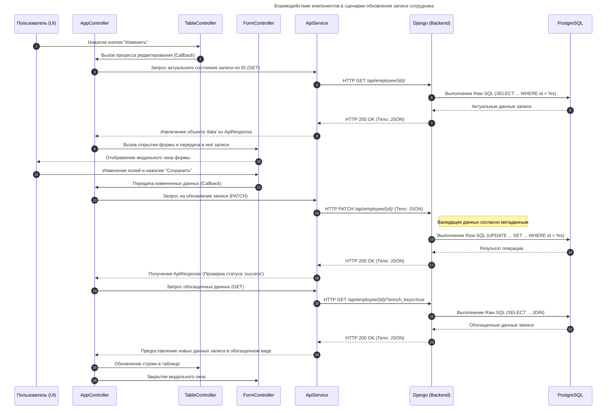

```mermaid
sequenceDiagram
    title Взаимодействие компонентов в сценарии обновления записи сотрудника
    autonumber
    participant User as Пользователь (UI)
    participant AppController
    participant TableController
    participant FormController
    participant ApiService
    participant Backend as Django (Backend)
    participant Postgres as PostgreSQL

    User->>TableController: Нажатие кнопки "Изменить"
    TableController->>AppController: Вызов процесса редактирования (Callback)
    AppController->>ApiService: Запрос актуального состояния записи по ID (GET)
    
    ApiService->>Backend: HTTP GET /api/employee/{id}/
    Backend->>Postgres: Выполнение Raw SQL (SELECT ... WHERE id = %s)
    Postgres-->>Backend: Актуальные данные записи
    Backend-->>ApiService: HTTP 200 OK (Тело: JSON)

    ApiService-->>AppController: Извлечение объекта 'data' из ApiResponse
    AppController->>FormController: Вызов открытия формы и передача в неё записи
    FormController-->>User: Отображение модального окна формы
    User->>FormController: Изменение полей и нажатие "Сохранить"
    FormController->>AppController: Передача измененных данных (Callback)
    AppController->>ApiService: Запрос на обновление записи (PATCH)

    ApiService->>Backend: HTTP PATCH /api/employee/{id}/ (Тело: JSON)
    Note right of Backend: Валидация данных согласно метаданным
    
    Backend->>Postgres: Выполнение Raw SQL (UPDATE ... SET ... WHERE id = %s)
    Postgres-->>Backend: Результат операции
    
    Backend-->>ApiService: HTTP 200 OK (Тело: JSON)
    ApiService-->>AppController: Получение ApiResponse (Проверка статуса 'success')
    
    AppController->>ApiService: Запрос обогащенных данных (GET)
    ApiService->>Backend: HTTP GET /api/employee/{id}/?enrich_keys=true
    Backend->>Postgres: Выполнение Raw SQL (SELECT ... JOIN)
    Postgres-->>Backend: Обогащенные данные записи
    Backend-->>ApiService: HTTP 200 OK (Тело: JSON)
    ApiService-->>AppController: Предоставление новых данных записи в обогащенном виде
    
    AppController->>TableController: Обновление строки в таблице
    AppController->>FormController: Закрытие модального окна
```